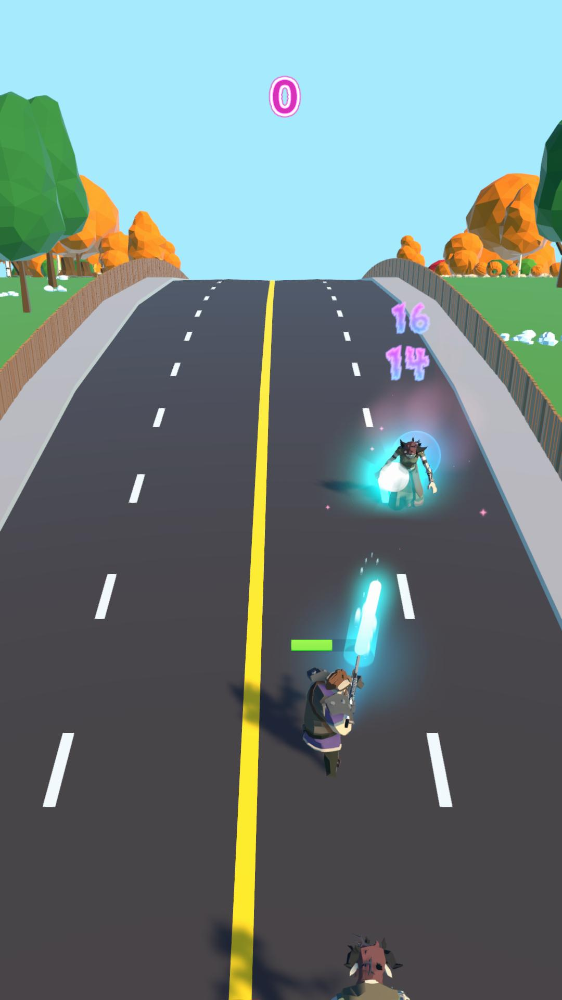
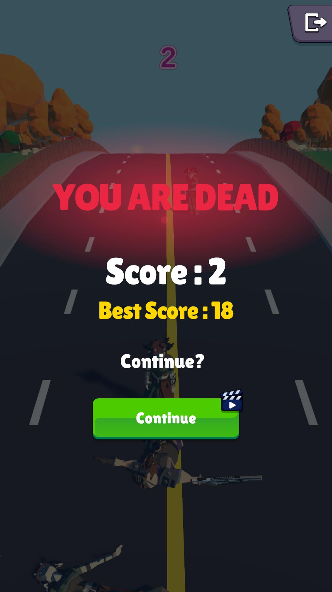

# Zombie Runner

[![Contributors][contributors-shield]][contributors-url]
[![Forks][forks-shield]][forks-url]
[![Stargazers][stars-shield]][stars-url]
[![Issues][issues-shield]][issues-url]

<!-- ABOUT THE PROJECT -->
## About The Project

Zombie Runner is an exciting and challenging action game where you play as a survivor in a world overrun by zombies. As you run through the streets, you must avoid obstacles, collect resources, and fend off hordes of undead. The game features multiple levels and weapons, and players must use their skills and strategy to survive as long as possible.

      

      

          

    

<!-- SETUP AND USAGE -->
## Setup and Usage

To run Zombie Runner, follow these steps:
  
1. Clone or download the repository to your local machine
2. Open the project in your Unity
3. Click the "Run" button to start the game

<!-- BUILT WITH -->
## Built With

Zombie Runner was built using the following technologies and tools:

- Unity3d
- C# for game logic and mechanics
- Lean Touch for touch and swipe controls
- Curved World for curved surfaces and paths
- Damage Numbers for all the number feeds and number effects
- Dreamteck Spline for customizable paths and movements
- Epic Toon FX for visual and audio effects
- Nice Vibration for haptic feedback
- Various assets and resources from the Unity Asset Store

Play Store Link : https://play.google.com/store/apps/details?id=io.BetaMode.LastManStanding

[contributors-shield]: https://img.shields.io/github/contributors/AbdullahAskin/ZombieRunner.svg?style=for-the-badge
[contributors-url]: https://github.com/AbdullahAskin/ZombieRunner/graphs/contributors
[forks-shield]: https://img.shields.io/github/forks/AbdullahAskin/ZombieRunner.svg?style=for-the-badge
[forks-url]: https://github.com/AbdullahAskin/ZombieRunner/network/members
[stars-shield]: https://img.shields.io/github/stars/AbdullahAskin/ZombieRunner.svg?style=for-the-badge
[stars-url]: https://github.com/AbdullahAskin/ZombieRunner/stargazers
[issues-shield]: https://img.shields.io/github/issues/AbdullahAskin/ZombieRunner.svg?style=for-the-badge
[issues-url]: https://github.com/AbdullahAskin/ZombieRunner/issues
[linkedin-shield]: https://img.shields.io/badge/-LinkedIn-black.svg?style=for-the-badge&logo=linkedin&colorB=555
[linkedin-url]: www.linkedin.com/in/abdullah-ahmet-askin
